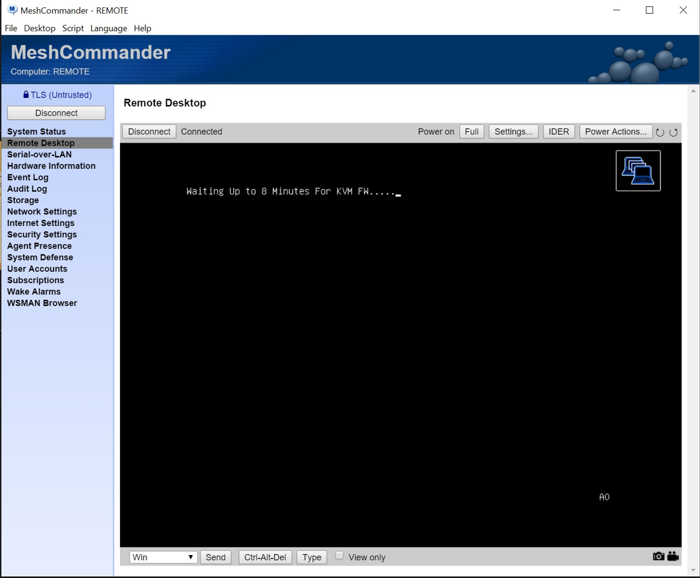
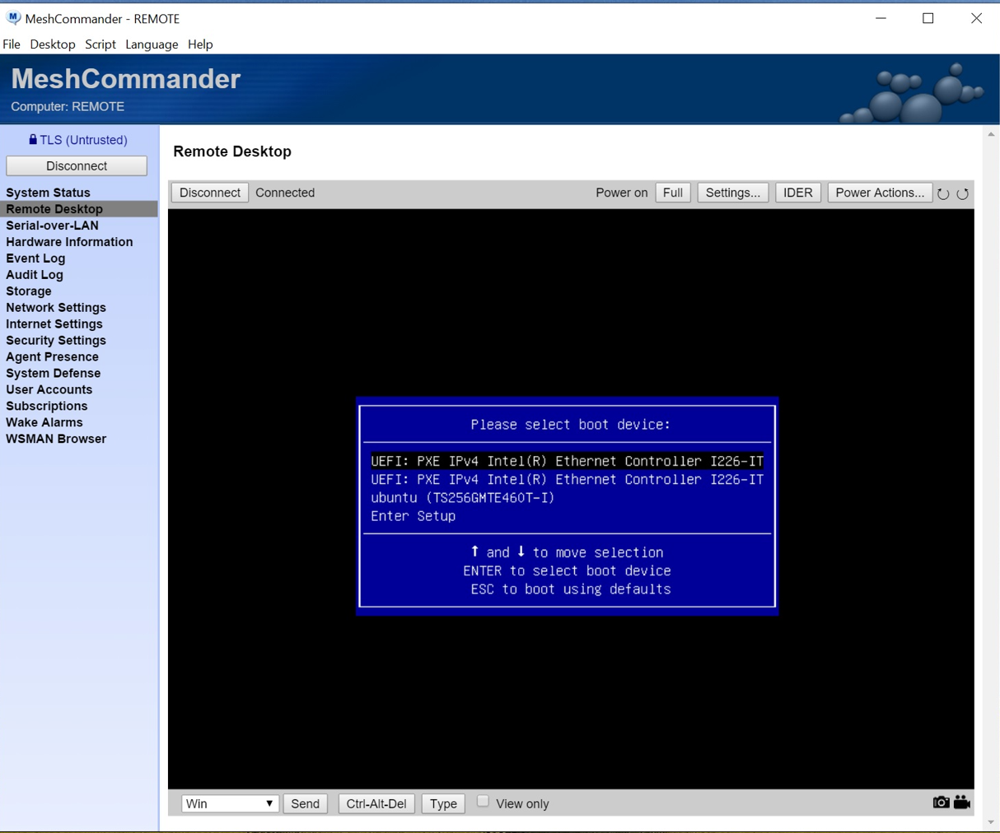
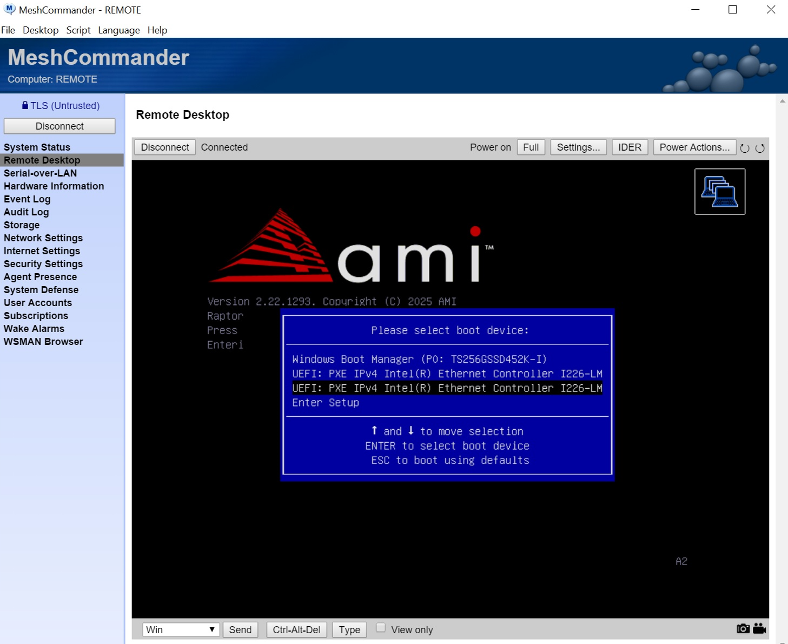
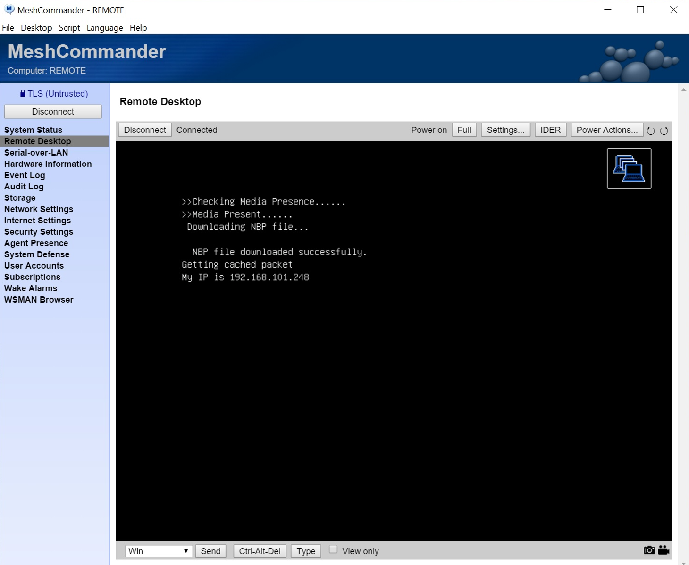
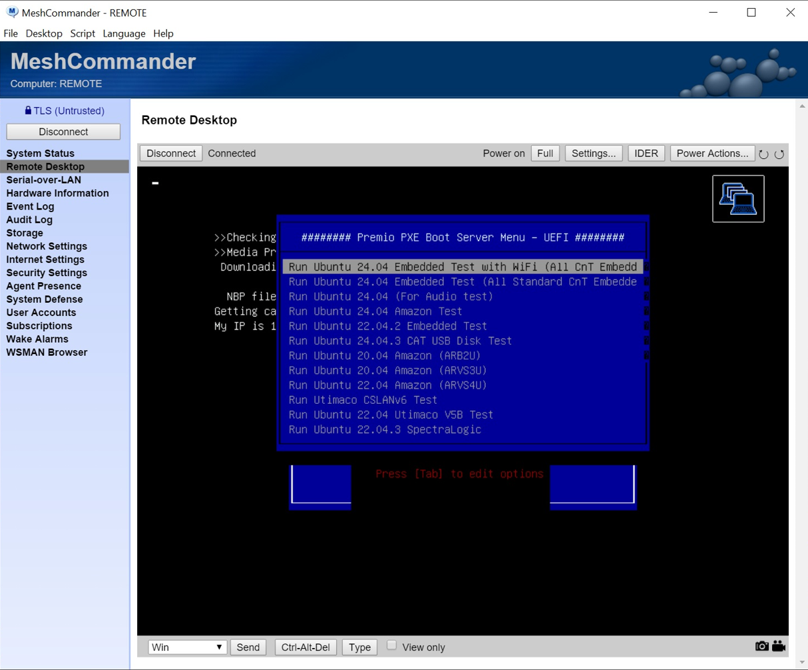
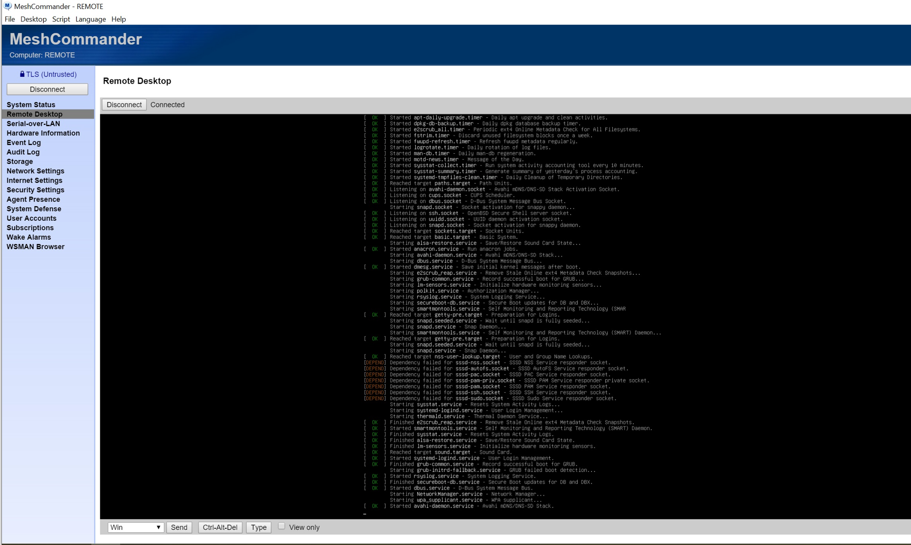
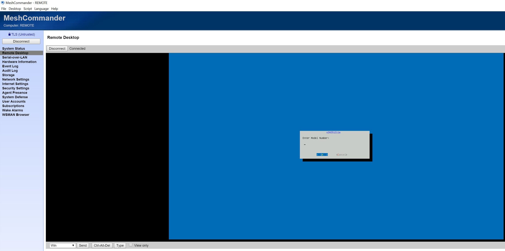

# Premio RCO-3000 PXE Boot Re-Imaging Runbook

## Overview

This runbook describes the procedure for re-imaging a **Premio RCO-3000** series server via PXE boot using Intel AMT remote management (MeshCommander). The process boots the unit into Ubuntu 24.04 from Premio's production PXE server and runs automated production testing.

**Hardware:** Premio RCO-3000 (Intel platform with AMT support)
**BIOS:** AMI BIOS v2.22.1293
**NIC:** Intel I226-LM / I226-IT Ethernet Controllers
**Remote Management:** Intel AMT via MeshCommander
**Target OS:** Ubuntu 24.04 LTS (Embedded Test image)

---

## Prerequisites

- [ ] Intel AMT is configured and accessible on the target unit
- [ ] MeshCommander is installed on your management workstation ([download](https://www.meshcommander.com/))
- [ ] The unit's **2nd LAN port** is connected to the PXE boot server network
- [ ] The PXE boot server is online and reachable from the unit
- [ ] You have the unit's AMT IP address and credentials
- [ ] You have the unit's serial number (S/N) for automated testing

---

## Network Configuration

| Interface | Purpose | Connection |
|-----------|---------|------------|
| LAN Port 1 | Management / Production network | Standard network |
| LAN Port 2 | PXE Boot | Connected to Premio PXE boot server |

> **Note:** Calvin Chen at Premio runs a long cable across the lab floor to connect to the Production PXE boot server. Coordinate with Premio before attempting PXE boot to ensure the cable is connected.

---

## Step-by-Step Procedure

### Step 1: Connect to the Unit via MeshCommander

1. Open MeshCommander
2. Connect to the unit's AMT IP address
3. Navigate to **Remote Desktop** in the left sidebar
4. Confirm the connection status shows **Connected**

### Step 2: Reboot the Unit and Enter Boot Menu

1. Use **Power Actions** > **Reset** to reboot the unit (or reboot from the OS)
2. Watch the POST screen carefully
3. **Press F7** when you see the AMI BIOS splash screen to open the boot device menu

> **Timing:** The F7 prompt appears briefly during POST. If you miss it, let the unit boot normally and try again.

### Step 3: Select PXE Boot Device

The boot menu will display available boot devices:

**Boot menu options (typical):**
- `UEFI: PXE IPv4 Intel(R) Ethernet Controller I226-IT` (1st NIC)
- `UEFI: PXE IPv4 Intel(R) Ethernet Controller I226-IT` (2nd NIC)
- `ubuntu (TS256GMTE460T-I)` (local SSD)
- `Enter Setup`

**Selection:**
- **Local unit (original):** Select the **1st** `UEFI: PXE IPv4` entry
- **Remote unit (updated by Calvin):** Select the **2nd** `UEFI: PXE IPv4` entry

> **Important:** The correct PXE entry depends on which LAN port is connected to the PXE server. For the remote unit, Calvin changed it to the 2nd option.

For the remote unit, the boot menu may show different NIC models (I226-LM vs I226-IT):

### Step 4: PXE Boot Process Initiates

After selecting the PXE boot device, the unit will:
1. Send a DHCP request on the selected NIC
2. Receive an IP address from the PXE server
3. Download the Network Boot Program (NBP)

> This step takes 30-60 seconds. If it times out, verify the LAN cable is connected to the correct port and the PXE server is reachable.

### Step 5: Select OS from Premio PXE Boot Server Menu

The **Premio PXE Boot Server Menu - UEFI** will appear with multiple options:

**Available options:**
| # | Menu Entry | Description |
|---|-----------|-------------|
| 1 | Run Ubuntu 24.04 Embedded Test with WiFi (All CnT Embedd) | **Standard production test** |
| 2 | Run Ubuntu 24.04 Embedded Test (All Standard CnT Embedded) | Without WiFi test |
| 3 | Run Ubuntu 24.04 (For Audio test) | Audio-specific test |
| 4 | Run Ubuntu 24.04 Amazon Test | Amazon SKU test |
| 5 | Run Ubuntu 22.04.2 Embedded Test | Legacy Ubuntu 22.04 |
| 6 | Run Ubuntu 24.04.3 CAT USB Disk Test | USB test |
| 7+ | Various Amazon/Utimaco/SpectraLogic tests | Specialized tests |

**Select the 1st entry** ("Run Ubuntu 24.04 Embedded Test with WiFi") for standard re-imaging and production testing.

### Step 6: Ubuntu 24.04 Boots

The unit will boot into Ubuntu 24.04 from the PXE server. You will see the standard Ubuntu boot process.

> This process takes 2-5 minutes depending on network speed.

### Step 7: Enter Unit Serial Number

Once Ubuntu has fully booted, a dialog box will appear prompting for the **Model Number** (unit S/N).

1. Enter the unit's serial number / model number in the text field
2. Click **OK** to start automated testing
3. Click **Cancel** to abort

> The automated test suite will then run Premio's production validation tests on the hardware.

---

## Troubleshooting

### PXE Boot Timeout
- Verify the LAN cable is connected to the correct port (2nd LAN port for PXE)
- Ensure the PXE server is online
- Contact Calvin Chen at Premio: (626) 839-3100 x1216

### F7 Boot Menu Doesn't Appear
- The F7 key must be pressed during the brief POST window
- Try pressing F7 repeatedly as soon as the unit starts POST
- If using MeshCommander, ensure the keyboard is not in "View only" mode

### Wrong PXE Option Selected
- If the unit tries to PXE boot on the wrong NIC, it will timeout
- Reboot and try the other UEFI PXE IPv4 option

### MeshCommander Connection Issues
- Verify AMT is enabled in BIOS
- Check that the AMT IP is reachable from your workstation
- Ensure AMT credentials are correct
- Try connecting via TLS (port 16993) or non-TLS (port 16992)

---

## Contacts

| Role | Name | Phone | Email |
|------|------|-------|-------|
| Premio Sustaining Manager | Calvin Chen | (626) 839-3100 x1216 / (714) 390-9482 | calvin.chen@premioinc.com |
| Premio Engineering | Andrew Lam | - | andrew.lam@premioinc.com |
| Premio Engineering | Yale Shih | - | yale.shih@premioinc.com |
| Premio Engineering | Eric Hsu | - | eric.hsu@premioinc.com |
| WWT Systems Engineer | Ron Graham | (858) 525-1625 | Ron.Graham@wwt.com |

---

## Automation

For automated/scripted PXE boot operations, see:
- [`../scripts/amt_controller.py`](../scripts/amt_controller.py) - Python AMT automation script
- [`../web/`](../web/) - Web-based management interface

These tools use Intel AMT WSMAN APIs to programmatically trigger PXE boot without requiring manual F7 key presses.
